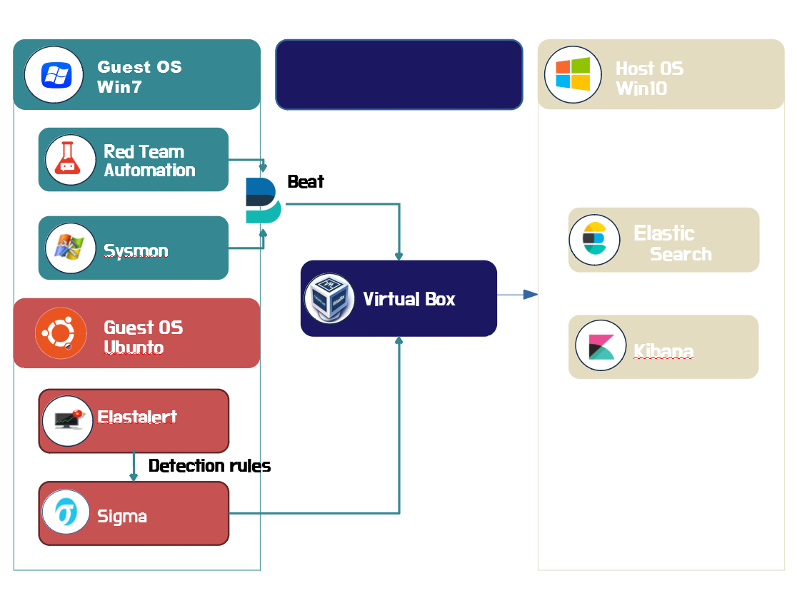

# Intelligent Incident Response Platform

##  목표 구성도 참고 
* Open Source Endpoint monitoring 
  - https://github.com/DearBytes/Opensource-Endpoint-Monitoring
  
## 시스템 구성도

   

##  환경 구성 

    
### Elastic Stack 64bit (Server 환경) - Host

| Program                | version                      | download            |  
|:---: | :---: | :---: |  
| Elastic Search          | 7.11.2          | https://www.elastic.co/kr/downloads/past-releases/elasticsearch-7-11-2 |
| Kibana        | 7.11.2          | https://www.elastic.co/kr/downloads/past-releases/kibana-7-11-2 |
|  Virtual Box         | 6.1.22           |https://www.virtualbox.org/wiki/Downloads/ |  
  

----------------------------------------------------------------------------------------------------------------------------------------------

### Windows 7 32bit (Endpoint 환경) - Guest OS
  
  
| Program                | 설명                  | download            |  
|:---: | :---: | :---: |  
|  Red Team Automation          | Red Team용 MITRE ATT@CK 기반 malicious attack 발생           |  https://github.com/endgameinc/RTA |
|  SwiftOnSecurity의 sysmon-config        | 보안로그 발생을 위한 sysmon 환경 파일         |  https://github.com/SwiftOnSecurity/sysmon-config|
|  sysmon           |            | microsoft의 sysinternals.com |
|  Elastic Winlogbeat 7.6.2       |         |  https://github.com/SwiftOnSecurity/sysmon-config|

  
 ### Elastalert  (Ubuntu 18.04 64bit 환경) - Guest OS
  
| Program                | version                      | download            |  
|:---: | :---: | :---: |  
|  elastalert          | 2.7.18 32bit            | https://www.python.org/downloads/release/python-2718/ |  

----------------------------------------------------------------------------------------------------------------------------------------------

### 공용 프로그램
| Program                | version                      | download            |  
|:---: | :---: | :---: |  
|  Python            | 2.7.18 32bit            | https://www.python.org/downloads/release/python-2718/ |  

##  실행 방법 

* Win7sp1 sysmon vm 환경 실행

* Win7sp1 sysmon vm 환경에서 sysmon 서비스 실행(관리자 계정)
  > sysmon.exe -i %configfile%
    (기존에 설치했다면 필요 없음)

* Win7sp1 sysmon vm 환경에서 winlogbeat 실행(관리자 계정)
  > winlogbeat.exe -c winlogbeat.yml

* Elastic Kibana 실행(관리자 계정)
  > bin/kibana.bat

* Elasticsearch 실행(관리자 계정)
  > bin/elasticsearch.bat

* Ubuntu 18.04 64bit 환경에서 Elasticalert 실행
  >/elastalert  
  >elastalert --verbose --start  --config <config.yaml> --rule <error.yaml>
 
## 메뉴얼 

* sysmon
  > https://github.com/trustedsec/SysmonCommunityGuide/blob/master/Sysmon.md

* elastic
  > https://www.elastic.co/guide/en/elastic-stack-get-started/7.6/get-started-elastic-stack.html#install-elasticsearch

* elastalert
  > https://elastalert.readthedocs.io/en/latest/running_elastalert.html
  
 ## 오류 수정 
 [[ windows 7 ]]
 * sysmon 10.x 실행 오류
   > kb2533623 설치 (wevtapi.dll 문제)
   
   > kb3033929 설치

* sysmon-config.xml

  **변경전** 
     
    > \<PipeEvent onmatch="exclude"\>
	
    > \<EVENTID condition="is"\>1\</EVENTID\> 
     
    > \<\/PipeEvent\>
          
   **변경후**   
   
     > \<PipeEvent onmatch="include"\>
			
     >**삭제**
	
     > \</PipeEvent\>
          
   **변경전**
   
     > \<WmiEvent onmatch="include"\>
		
     >    \<Operation condition="is">Created</Operation\> 
            
     > \</WmiEvent\>
           
   **변경후**     
   
     > \<WmiEvent onmatch="include"\>
	
     > **삭제** 
	
     > \</WmiEvent\>
        
[[ Elasticsearch ]] 
* network.host 설정 bootstrap checks failed
  > https://soye0n.tistory.com/178

[[ Elastalert ]]
* pip install 오류
  > python version 3.6 다운
